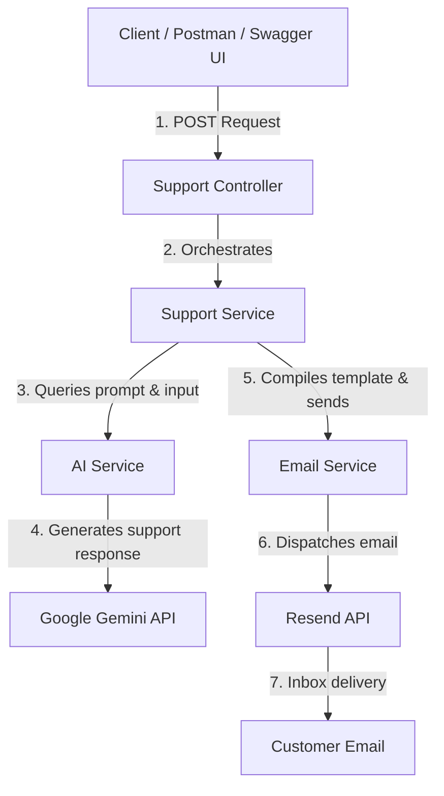

# AI Customer Support Assistant Backend

An automated customer support service built with NestJS, utilizing Google Gemini API to generate helpful responses, Resend to email them to customers, Swagger for API design, and Sentry for error tracking.

## Architecture Overview

Here is a simple conceptual flow of the application:



## Features

- **AI Support Response**: Analyzes customer queries and generates professional, polite, and contextual solutions under a custom-tailored system prompt.
- **Email Delivery**: Dispatches a premium, beautifully-styled HTML email containing the original message and the AI-generated solution directly to the customer.
- **REST Validation**: Employs robust class-validators protecting controllers from poorly structured JSON payloads.
- **REST Documentation**: Exposes interactive API documentation using Swagger at `/api/docs`.
- **Error Monitoring**: Integrates Sentry to capture real-time 500 exceptions without breaking local development.

---

## Tech Stack

- **Backend Framework**: NestJS (TypeScript / Node.js)
- **AI Integration**: Google Gemini API (Google Gen AI SDK)
- **Email Dispatcher**: Resend SDK
- **API Documentation**: Swagger (`@nestjs/swagger`)
- **Monitoring**: Sentry (`@sentry/nestjs`)
- **Configuration**: `@nestjs/config` & `dotenv`

---

## Environment Variables

Create a `.env` file in the root directory. You can use the provided `.env.example` as a template:

```env
PORT=3000
GEMINI_API_KEY=your_gemini_api_key
RESEND_API_KEY=your_resend_api_key
RESEND_FROM_EMAIL=onboarding@resend.dev
SENTRY_DSN=your_sentry_dsn
```

*Note: If `GEMINI_API_KEY` or `RESEND_API_KEY` are not configured, the respective integrations will throw meaningful backend errors. If `SENTRY_DSN` is empty, Sentry logging will skip initialization gracefully.*

---

## Installation & Setup

1. **Clone or Navigate to the workspace:**
   ```bash
   git clone <https://github.com/hamzaking0838/AI-Customer-Support-Assistant>
   cd ai-support-customer
   ```

2. **Install Dependencies:**
   ```bash
   npm install
   ```

3. **Configure Environment Variables:**
   Create a `.env` file and input your API keys.

4. **Build the Application:**
   ```bash
   npm run build
   ```

5. **Run Locally:**
   - **Development watch mode:**
     ```bash
     npm run start:dev
     ```
   - **Production build mode:**
     ```bash
     npm run start:prod
     ```

---

## API Documentation

Swagger is available at:
- **`http://localhost:3000/api/docs`**

### 1. Generate Chat Reply
- **Endpoint**: `POST /support/chat`
- **Description**: Generates an AI support reply for the customer query.
- **Request Body**:
  ```json
  {
    "name": "Ali",
    "email": "your-real-email@gmail.com",
    "message": "My order has not arrived yet. What should I do?"
  }
  ```
  **Note:** For testing email delivery, use a real recipient email address. The Resend testing environment does not accept `example.com` addresses.
- **Response (200 OK)**:
  ```json
  {
    "success": true,
    "customerName": "Ali",
    "reply": "I'm sorry to hear that your order has not arrived yet. Please provide your order number so we can help you check the delivery status."
  }
  ```

### 2. Generate and Send Reply via Email
- **Endpoint**: `POST /support/email`
- **Description**: Generates the AI reply and sends a stylized email to the customer.
- **Request Body**:
  ```json
  {
    "name": "Ali",
    "email": "your-real-email@gmail.com",
    "message": "My order has not arrived yet. What should I do?"
  }
  ```
   **Note:** For testing email delivery, use a real recipient email address. The Resend testing environment does not accept `example.com` addresses.
- **Response (200 OK)**:
  ```json
  {
    "success": true,
    "message": "Support response generated and email sent successfully.",
    "reply": "I'm sorry to hear that your order has not arrived..."
  }
  ```

---

## Key Integrations

### 1. AI System Prompt Integration
Located at `src/ai/ai.service.ts`, the customer support model uses a defined system prompt:
- Always maintains a polite and professional tone.
- Avoids making commitments or saying actions have occurred when they haven't (e.g., address updates, refunds).
- Requests essential parameters like order numbers when absent.

### 2. Email Delivery via Resend
Located at `src/email/email.service.ts` and `src/email/email.template.ts`.
- Uses Resend to send HTML content.
- Employs a modern HTML email template layout designed with Inter fonts, sleek colors (indigo gradients), and structured sections for "Your Message" and "Our Response".

### 3. Application Monitoring with Sentry
- Configured in `src/main.ts` using the global exception filter `SentryExceptionFilter`.
- Intercepts and captures uncaught errors or 5xx failures. Client validation errors (400 Bad Request) are ignored to maintain noise-free telemetry.

---

## Future Improvements

1. **Authentication & API Keys**: Guard the endpoints with client API keys.
2. **Database Integration**: Store customer support tickets in PostgreSQL or MongoDB for audit trails.
3. **Queue System**: Implement BullMQ for email dispatching to handle high-traffic support requests asynchronously.
"# AI-Customer-Support-Assistant" 
